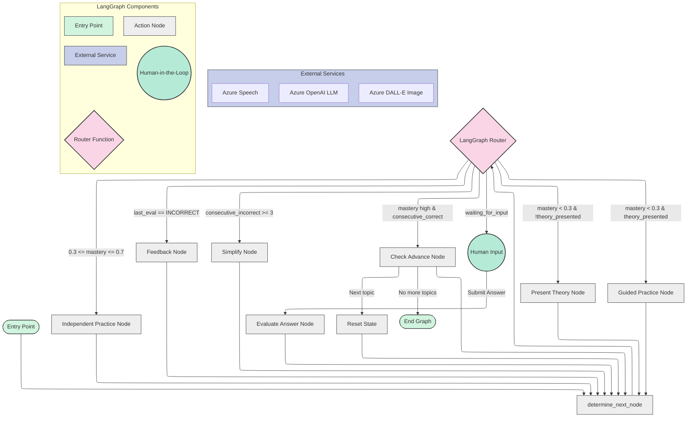

# Math Journey: Adaptive Math Tutor with Singapore Method

This project implements Math Journey, a personalized math tutoring agent that uses the Singapore Method and the CPA (Concrete-Pictorial-Abstract) approach to help students understand mathematical concepts effectively. It leverages Azure AI services for core logic, multimodal generation, and speech synthesis.

## Key Features

*   **Adaptive Diagnostics:** Assesses the current level of understanding and adapts instruction accordingly. (Implemented via initial mastery or diagnostic input)
*   **Singapore Method (CPA):** Implements the Concrete-Pictorial-Abstract approach for deep understanding, dynamically adjusting based on student progress.
*   **Structured Curriculum:** Utilizes defined Learning Roadmaps (`data/roadmaps.py`) with prerequisites and mastery goals to guide the learning sequence. Easily extensible.
*   **Thematic Personalization:** Examples and problems are contextualized according to the student's interests (e.g., space, animals).
*   **Multimodal Generation:** Combines text (Azure OpenAI), images (Azure DALL-E), and audio (Azure Speech) for a complete, engaging experience.
*   **Intelligent Adaptation:** Dynamically adjusts the difficulty level and teaching approach (e.g., simplifying instruction, providing feedback) in real-time based on student performance using a custom state machine logic.

## Project Structure

The project is divided into backend and frontend:

### Backend (FastAPI)

The backend houses the core agent logic, API endpoints, and interactions with Azure services. It currently includes two agent implementations:

1.  **`AdaptiveLearningAgent` (in `agents/learning_agent.py`):** A custom-built agent using a state machine approach to manage the learning flow based on student state and curriculum roadmaps.
2.  **`LangGraphAdaptiveLearningAgent` (in `agents/LangGraphAdaptiveLearningAgent.py`):** An alternative implementation using LangGraph to structure the agent's workflow as a state graph.

```
└── backend/
    ├── README.md
    ├── main.py                     # API entry point
    ├── config.py                   # Configuration loading (.env)
    ├── requirements.txt            # Python dependencies
    ├── .env.example                # Example environment variables
    ├── agents/
    │   ├── __init__.py
    │   ├── functions.py            # Core actions (theory, practice, eval, etc.)
    │   ├── learning_agent.py       #  State Machine Agent 
    │   └── LangGraphAdaptiveLearningAgent.py # LangGraph Agent 
    ├── api/
    │   ├── __init__.py
    │   ├── http_routes.py          # Standard HTTP API endpoints
    │   └── ws_routes.py            # WebSocket endpoints for real-time interaction
    ├── data/
    │   ├── __init__.py
    │   └── roadmaps.py             # Curriculum definitions (Addition, Fractions, etc.)
    ├── models/
    │   ├── __init__.py
    │   ├── curriculum.py           # Logic for accessing roadmap data
    │   ├── schemas.py              # API request/response models
    │   └── student_state.py        # Pydantic model for student session state
    ├── prompts/                    # Prompty templates for LLM interactions
    │   ├── __init__.py
    │   ├── evaluation.prompty
    │   ├── feedback.prompty
    │   ├── guided_practice.prompty
    │   ├── image_generation.prompty
    │   ├── independent_practice.prompty
    │   └── theory.prompty
    ├── services/                   # Integration with external services
    │   ├── __init__.py
    │   └── azure_service.py        # Azure OpenAI, DALL-E, Speech clients
    ├── static/                     # Directory for serving generated images/audio
    │   ├── audio/
    │   └── images/
    └── utils/                      # Utility functions
        ├── __init__.py
        └── audios.py               # Predefined audio core TTS
```

### Frontend (Next.js + TypeScript)

Built with Next.js (App Router) and TypeScript, using Tailwind CSS and `shadcn/ui` for styling and components. It provides the user interface for interacting with the Math Journey agent.

**Key Frontend Components:**

*   **API Client (`app/api/MathTutorClient.ts`):** Handles communication with the backend, primarily via WebSockets for real-time updates during a lesson.
*   **State Management (`contexts/TutorProvider.tsx`, `hooks/use-math-tutor.ts`):** Uses React Context and custom hooks to manage the session state, messages, and interaction logic within the browser.
*   **Routing (`app/*`):** Defines the user flow through pages like greeting, name input, theme selection, learning path choice, diagnostic tests, and the main lesson interface.
*   **Interactive Elements (`components/`):** Includes specialized components for the tutor experience, such as `visual-display.tsx` (for text/images), `audio-player.tsx`, `input-box.tsx` / `number-pad.tsx` (for answers), `feedback-display.tsx`, and `progress-dots.tsx`.
*   **UI Primitives (`components/ui/`):** Contains `shadcn/ui` components (Button, Card, Dialog, etc.) for building the interface.

```
└── frontend/
    └── math-journey/
        ├── components.json         # Likely shadcn/ui config
        ├── next.config.ts          # Next.js configuration
        ├── package.json            # Frontend dependencies
        ├── tailwind.config.ts      # Tailwind CSS configuration
        ├── tsconfig.json           # TypeScript configuration
        ├── .gitignore
        ├── app/                    # Next.js App Router structure
        │   ├── globals.css
        │   ├── layout.tsx          # Main layout
        │   ├── page.tsx            # Root page (likely redirects or initial greeting)
        │   ├── api/
        │   │   └── MathTutorClient.ts # Backend API/WebSocket client
        │   ├── diagnostic/
        │   │   └── page.tsx        # Diagnostic test page
        │   ├── greeting/
        │   │   └── page.tsx        # Initial welcome page
        │   ├── learning-path/
        │   │   └── page.tsx        # Roadmap selection page
        │   ├── lesson/
        │   │   └── page.tsx        # <<< Main interactive lesson interface >>>
        │   ├── name/
        │   │   └── page.tsx        # Student name input page
        │   └── theme/
        │       └── page.tsx        # Theme selection page
        ├── components/
        │   ├── audio-controls.tsx
        │   ├── audio-player.tsx    # Handles TTS playback
        │   ├── feedback-display.tsx # Shows evaluation results
        │   ├── input-box.tsx       # User answer input area
        │   ├── number-pad.tsx      # Alternative input method
        │   ├── progress-dots.tsx   # Visual progress indicator
        │   ├── toast-debugger.tsx  # Development helper
        │   ├── visual-display.tsx  # Displays text/images from agent
        │   └── ui/                 # UI library components (likely shadcn/ui)
        │       ├── # ... (button.tsx, card.tsx, etc.)
        ├── contexts/
        │   └── TutorProvider.tsx   # React Context for global state
        ├── hooks/
        │   └── use-math-tutor.ts   # Custom hook to interact with TutorContext
        ├── lib/
        │   └── utils.ts            # Utility functions
        ├── public/                 # Static assets served directly
        │   ├── audios/             # Placeholder/default audio?
        │   └── images/             # Thematic/UI images
        └── types/
            └── api.ts              # TypeScript types for API communication
```


## LangGraph Agent Flow

This diagram illustrates the flow of `LangGraphAdaptiveLearningAgent`. It uses the core functions from `agents/functions.py` as nodes within the graph.



## Learning Paths & Curriculum Design

The system includes structured learning paths (roadmaps) defined in `backend/data/roadmaps.py` and accessed via `backend/models/curriculum.py`. Each roadmap uses `LearningRoadmap` and `RoadmapTopic` Pydantic models, defining a sequence of topics with prerequisites and mastery requirements. This structure guides the agent's progression and ensures pedagogical soundness.

Current roadmaps include:

*   Fractions
*   Addition
*   Subtraction
*   Multiplication
*   Division

## Getting Started

### Prerequisites

*   Python 3.9+
*   Node.js and npm/yarn (for frontend)
*   Access to Azure subscription with deployed services:
    *   Azure OpenAI (GPT-4o or similar deployment) - **Required**
    *   Azure DALL-E 3 deployment - *Optional, for image generation*
    *   Azure Speech Services - *Optional, for text-to-speech*

### Backend Setup

1.  **Navigate to Backend Directory:**
    ```bash
    cd jrobador-mathia/backend
    ```
2.  **Create and Activate Virtual Environment:**
    ```bash
    python -m venv venv
    # On Windows: .\venv\Scripts\activate
    # On macOS/Linux: source venv/bin/activate
    ```
3.  **Install Dependencies:**
    ```bash
    pip install -r requirements.txt
    ```
4.  **Configure Environment Variables:**
    *   Copy the example file: `cp .env.example .env` (or `copy .env.example .env` on Windows)
    *   Edit the `.env` file and fill in your Azure service credentials:
        *   `AZURE_OPENAI_ENDPOINT`, `AZURE_OPENAI_API_KEY`, `AZURE_OPENAI_CHAT_DEPLOYMENT` are **required**.
        *   Fill in `AZURE_DALLE_ENDPOINT`, `AZURE_DALLE_API_KEY` if using image generation.
        *   Fill in `AZURE_SPEECH_SUSCRIPTION_KEY`, `AZURE_SPEECH_REGION` if using text-to-speech.
        *   Adjust `ALLOWED_ORIGINS` if your frontend runs on a different port than `http://localhost:3000`.
5.  **Run the FastAPI Server:**
    ```bash
    uvicorn main:app --reload --host 0.0.0.0 --port 8000
    ```
    *   The `--reload` flag is useful for development, as it automatically restarts the server on code changes.
    *   The server will be accessible at `http://localhost:8000`. The API docs are usually at `http://localhost:8000/docs`.

### Frontend Setup 

1.  **Navigate to Frontend Directory:**
    ```bash
    cd ./frontend/math-journey
    ```
2.  **Install Dependencies:**
    ```bash
    npm install
    # or yarn install
    ```
3.  **Run the Development Server:**
    ```bash
    npm run dev
    # or yarn dev
    ```
4.  Open your browser to `http://localhost:3000`.

## Future Adaptation

The system is designed for extensibility:

1.  **Add New Learning Paths:** Define new `LearningRoadmap` objects in `backend/data/roadmaps.py` and add them to `AVAILABLE_ROADMAPS` in `backend/models/curriculum.py`.
2.  **Create New Prompts:** Add new topic-specific `.prompty` files in `backend/prompts/` and update `agents/functions.py` to use them.

## Credits

Developed as a demo project integrating Azure OpenAI, DALL-E, Azure Speech, and FastAPI (with LangGraph code present) to create adaptive educational agents.